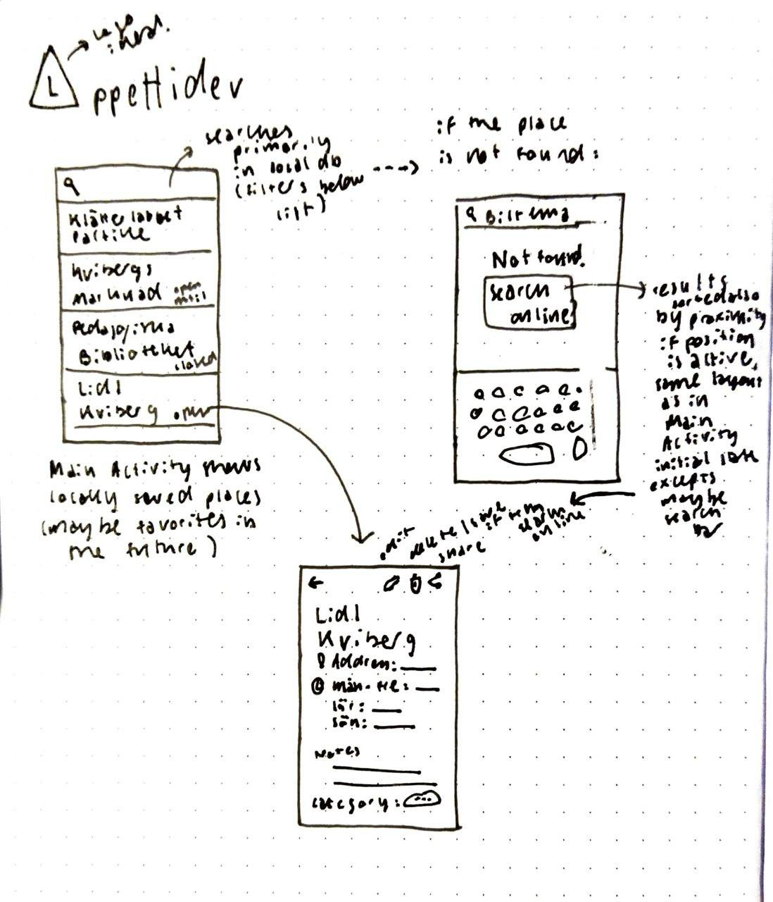

# Appettider
From Swedish "Öppettider", an app to quickly access your favorite places' opening times. 

Built to practice Android development and try out Jetpack Compose.

## Features

### V0 (fully offline)
- [ ] show the list of places stored in the local database in the main activity
- [ ] show place details in a secondary activity
  - name
  - address
  - opening times
  - notes
- [ ] add, edit and remove opening times for a given place
- [ ] search local database

### V1
- [ ] query [Google APIs](https://developers.google.com/maps/documentation/places/web-service/details) and/or similar (YELP, Facebook...) to get and update opening times automatically
- [ ] optionally use GPS to order search results by distance from current position

### Future features
- [ ] show a place's current status already in the list (open until/closed until/permanently closed)
- [ ] highlight current day when showing a place's details
- [ ] favorites (show only those on startup)
- [ ] (customizable) categories (to be used e.g. when searching)

## Prototype

